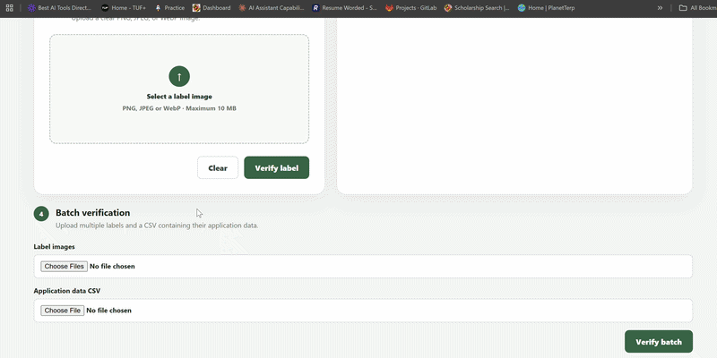
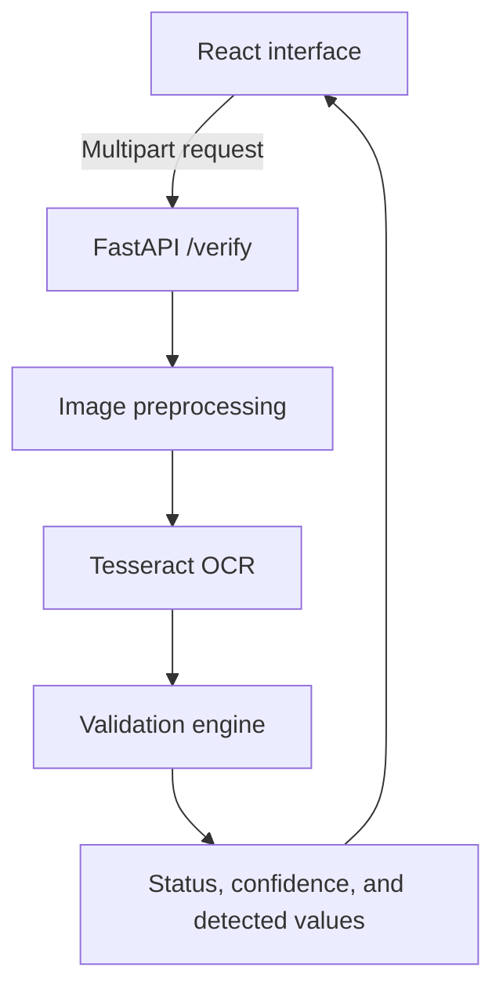

# AI-Powered Alcohol Label Verifier

A standalone proof-of-concept that helps alcohol-label compliance reviewers compare label artwork with application data. The application extracts text locally with Tesseract OCR and checks the brand name, class/type, alcohol content, net contents, and required government warning.

The prototype is designed to reduce repetitive visual comparison while keeping uncertain results visible for human review.

## Live Application

- **Live demo:** [alcohol-label-verifier-1.onrender.com](https://alcohol-label-verifier-1.onrender.com/)
- **API health check:** [alcohol-label-verifier-v8rw.onrender.com/health](https://alcohol-label-verifier-v8rw.onrender.com/health)
- **Interactive API documentation:** [alcohol-label-verifier-v8rw.onrender.com/docs](https://alcohol-label-verifier-v8rw.onrender.com/docs)

## Demo



The demo shows the main verification workflow:

1. Upload an alcohol label image.
2. Enter the expected application information.
3. Run the verification.
4. Review the field-level results as `PASS`, `NEEDS_REVIEW`, or `FAIL`.
5. Inspect the extracted OCR text.
6. Use the batch-upload workflow to verify multiple labels.

### Try It Yourself

[Open the Alcohol Label Verifier](https://alcohol-label-verifier-1.onrender.com/)


### Try with Sample Files

You can test the application using the sample files included in this repository.

#### Single Upload Samples

- [Sample Label 1](demo/silver_fox_vodka_label.png)
- [Sample Label 2](demo/old_tom_bourbon_label.png)
- [Sample Label 3](demo/redcrest_larger_label.png)

Try uploading each label individually using the **single-label verification** workflow.

#### Batch Upload Sample

- [Batch Upload CSV](demo/sample_batch.csv)

You can also use the sample CSV file with the **batch-upload workflow** to test multiple label verifications together.
## Problem

TTB compliance agents review a large volume of label applications and manually compare submitted artwork with application fields. Much of this work is routine matching, but OCR imperfections and harmless presentation differences still require judgment.

This prototype focuses on three stakeholder priorities:

1. Return a result in approximately five seconds.
2. Provide a simple interface for users with different levels of technical experience.
3. Support multiple-label uploads during high-volume review periods.

## Features

- Upload and preview an alcohol-label image.
- Enter the expected application data for comparison.
- Extract label text with locally hosted Tesseract OCR; no external OCR or LLM API is required.
- Validate:
  - Brand name
  - Class/type designation
  - Alcohol by volume (ABV)
  - Net contents
  - Government health warning text
- Return clear `PASS`, `NEEDS_REVIEW`, or `FAIL` results with detected values and confidence scores.
- Recognize brand names and class/type designations split across adjacent lines.
- Tolerate capitalization, punctuation, whitespace, and minor OCR differences where appropriate.
- Normalize equivalent volume formats, including liters, milliliters, and fluid ounces.
- Handle common OCR variations such as `ALC.IVOL.`.
- Process multiple images through a batch-upload workflow.
- Allow reviewers to inspect the raw extracted OCR text.
- Avoid permanent storage of uploaded images and results.

## Architecture



The frontend is deployed as a Render static site. The Dockerized backend runs FastAPI, Uvicorn, the image-processing pipeline, and the native Tesseract executable as a separate Render web service.

## Technology Choices

| Area | Technology | Reason |
|---|---|---|
| Frontend | React and Vite | Fast, accessible single-page interface and lightweight production build |
| API | FastAPI and Uvicorn | Typed request handling, validation, and automatic API documentation |
| OCR | Tesseract with pytesseract | Runs locally without dependence on an external cloud endpoint |
| Image processing | Pillow | Lightweight preprocessing before OCR |
| Matching | RapidFuzz and regular expressions | Supports explainable fuzzy text comparison and structured field extraction |
| Testing | pytest | Focused regression coverage for validation rules and OCR edge cases |
| Deployment | Docker and Render | Packages Python, native Tesseract, dependencies, and application code consistently |

## Validation Approach

### Brand name and class/type

Text is normalized before fuzzy comparison. The matcher evaluates individual OCR lines as well as combinations of up to three adjacent lines, allowing values such as `AMERICAN` and `MERLOT` to match the expected value `American Merlot`.

### Alcohol content

Regular expressions extract the ABV from common label formats. The parser also handles selected OCR substitutions observed during testing, such as `ALC.IVOL.` in place of `ALC./VOL.`.

### Net contents

Detected quantities are normalized to comparable units. This allows equivalent declarations such as `12 FL. OZ. (355 mL)` and `355 mL` to be evaluated correctly.

### Government warning

The required wording is normalized across line breaks, punctuation, spacing, and capitalization before comparison. Partial fuzzy matching tolerates minor OCR errors and does not reject an otherwise complete warning because unrelated wording, such as `CONTAINS SULFITES`, follows it.

The prototype validates textual content. Typography requirements such as bold weight, font size, and visual prominence remain part of manual review.

### Statuses

- **PASS:** The detected value meets the configured match rule.
- **NEEDS_REVIEW:** The field is missing or close enough that a person should verify it.
- **FAIL:** The detected value differs significantly from the application value or required wording.

This three-state design avoids presenting uncertain OCR output as an automatic compliance decision.

## Performance

Measurements on the deployed prototype:

- Single label: approximately **3–4 seconds**
- Three-label batch: approximately **10 seconds**
- Local single-label processing: approximately **0.69 seconds**

Batch items are currently processed sequentially through the same verification pipeline. Timing varies with image dimensions, image quality, server load, and OCR complexity.

## Project Structure

```text
Alcohol_label_Verifier/
├── backend/
│   ├── app/
│   │   ├── main.py
│   │   ├── services/
│   │   │   ├── image_processor.py
│   │   │   ├── ocr_service.py
│   │   │   └── validation_service.py
│   │   └── tests/
│   │       └── test_validation_service.py
│   ├── Dockerfile
│   ├── requirements.txt
│   └── .dockerignore
├── frontend/
│   ├── src/
│   │   ├── components/
│   │   ├── utils/
│   │   └── App.jsx
│   ├── .env.example
│   └── package.json
└── README.md
```

## Run with Docker

### Prerequisites

- Docker Desktop
- Node.js and npm

### 1. Clone the repository

```bash
git clone https://github.com/Abhishekpo/Alcohol_label_Verifier.git
cd Alcohol_label_Verifier
```

### 2. Build and run the backend

```bash
cd backend
docker build -t alcohol-label-verifier-backend .
docker run --rm -p 8000:8000 alcohol-label-verifier-backend
```

Confirm that the API is available at:

- `http://127.0.0.1:8000/health`
- `http://127.0.0.1:8000/docs`

The Docker image installs the native Tesseract program as well as the Python dependencies. A separate host installation of Tesseract is not required when using Docker.

### 3. Configure and run the frontend

Open a second terminal from the repository root:

```bash
cd frontend
```

Create a `.env` file based on `.env.example`:

```env
VITE_API_URL=http://127.0.0.1:8000
```

Install dependencies and start Vite:

```bash
npm install
npm run dev
```

Open `http://localhost:5173`.

## Run the Backend Without Docker

Python 3.10 and a system installation of Tesseract are required.

From the repository root on Windows Command Prompt:

```bat
cd backend
python -m venv .myenv
.myenv\Scripts\activate
python -m pip install -r requirements.txt
python -m uvicorn app.main:app --reload
```

Tesseract must be available through the operating system `PATH`.

## Environment Variables

| Service | Variable | Example |
|---|---|---|
| Frontend | `VITE_API_URL` | `http://127.0.0.1:8000` |
| Backend | `FRONTEND_URL` | `http://localhost:5173` |

For deployment, each value should use the corresponding HTTPS Render URL without a trailing slash.

## API

### `GET /health`

Returns a lightweight service-health response.

### `POST /verify`

Accepts an image and application data as `multipart/form-data`, runs OCR and validation, and returns the extracted text plus field-level validation results.

The interactive request schema and response format are available through the deployed [Swagger UI](https://alcohol-label-verifier-v8rw.onrender.com/docs).

## Tests

The validation suite currently contains **13 passing tests** covering standard cases and regression cases found during realistic OCR testing, including:

- Standard and OCR-distorted alcohol percentages
- Missing alcohol content
- Case-insensitive and incorrect brand names
- Brand and class/type values split across multiple lines
- Equivalent and mismatched volume declarations
- Missing net contents
- Multiline government warnings
- Extra text following a complete government warning

Run the suite from the repository root:

```bat
cd backend
python -m pytest -v
cd ..
```

Run the tests inside Docker:

```bash
cd backend
docker run --rm alcohol-label-verifier-backend python -m pytest -v
```

Expected result:

```text
13 passed
```

## Assumptions and Trade-offs

- The application is a standalone proof-of-concept and does not integrate with the COLA system.
- Submitted application values are treated as the expected source data.
- The system assists a compliance agent; it does not issue a final legal or regulatory determination.
- Fuzzy thresholds favor escalation to `NEEDS_REVIEW` when OCR confidence is uncertain.
- Batch images are processed sequentially to reuse the verified single-image pipeline and keep the prototype predictable.
- Uploaded images, extracted text, and results are processed in memory and are not intentionally persisted by the application.
- The current scope validates five core fields. Producer/address, country of origin, and beverage-specific rules would require additional structured application fields and validation modules.

## Known Limitations

- Tilted or upside-down labels can reduce OCR accuracy.
- Blurry, low-resolution, reflective, or poorly lit images may require manual review or a better image.
- Curved bottle surfaces and highly decorative typography can affect text extraction.
- Typography and layout requirements—including boldness, font size, and prominence—are not fully verified by text OCR.
- Sequential batch processing is appropriate for the prototype but is not optimized for hundreds of simultaneous labels.
- Processing time depends on the compute resources of the deployed backend.

## Future Improvements

- Add orientation detection, deskewing, glare reduction, and stronger perspective correction.
- Add layout-aware OCR to evaluate warning placement, capitalization, boldness, and font size.
- Validate producer/address and country-of-origin fields.
- Add beverage-specific regulatory rule sets.
- Introduce bounded parallel batch processing, progress reporting, and downloadable summaries.
- Add audit logging, authentication, retention controls, accessibility testing, and federal deployment hardening for production use.
- Evaluate alternative self-hosted OCR models against a labeled benchmark dataset.

## Author

**Abhishek Poudel**  
[poudelabhishek24@gmail.com](mailto:poudelabhishek24@gmail.com)

## Disclaimer

This project is a time-constrained prototype for demonstrating engineering and product decisions. It is not an official TTB system and should not be used as the sole basis for a compliance decision.
